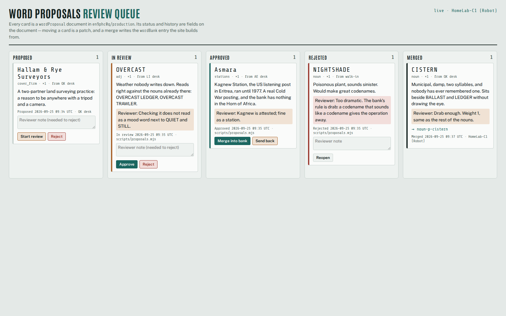
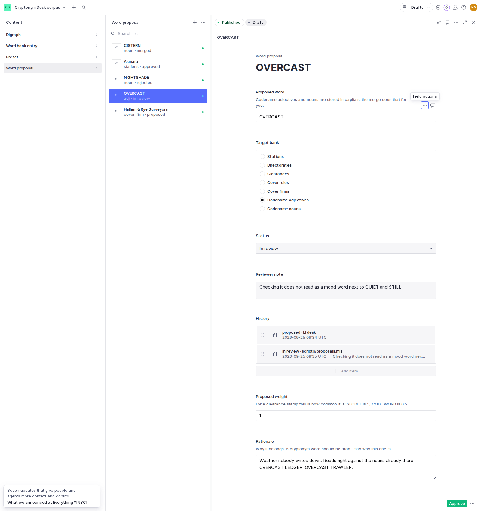

# Cryptonym Desk — on Astro + Sanity

**Name the films, anime and characters you like. The desk issues you a cryptonym,
a working alias and a field codename built out of them.**

→ **[Open it](https://casareanderson.github.io/cryptonym-desk-sanity/)** ·
[see the corpus](https://casareanderson.github.io/cryptonym-desk-sanity/corpus/)

This is a rebuild of [Cryptonym Desk](https://github.com/casareanderson/cryptonym-desk),
a single HTML file with its word banks hard-coded in a `<script>`. Here the
word banks, digraphs and presets live in a **public Sanity dataset**, and the page
is an Astro site built from it.

## Sanity project

- Project ID: **`en9phc0q`**, dataset **`production`** (public read)
- Read the whole corpus, no token:
  `https://en9phc0q.api.sanity.io/v2024-01-01/data/query/production?query=*[_type in ["digraph","wordBank","preset"]]`
- Schema: [`studio/schemaTypes/index.js`](studio/schemaTypes/index.js) — `digraph`, `wordBank`, `preset`, plus `wordProposal` for the [review workflow](#word-proposals-workflow)

## What changed from the single-file version

- **The corpus is data, not code.** 103 documents: 20 digraphs, 77 word-bank
  entries across 7 banks, 6 presets. Anyone can read, fork or extend it.
- **Weights are real.** Each word-bank entry has a `weight`; the generator does a
  weighted pick. Clearance stamps are weighted so plain `SECRET` is common and
  `CODE WORD` is rare — an edit in the dataset, not a code change.
- **Build-time only.** Astro fetches the corpus while it builds and bakes it into
  the page. A visitor's browser never talks to Sanity, so the original promise
  still holds: what you type never leaves the page.
- **Records carry a corpus revision.** A record is seeded from your inputs plus a
  salt — and now also depends on the corpus. The revision (a hash of every
  document's `_rev`) is printed on the record, because a record is only
  rebuildable against the corpus it was drawn from.
- **The build refuses a bad corpus.** An empty bank, an unknown bank, a zero
  weight or no active digraphs fails the build instead of shipping a page that
  throws on click. The Studio schema enforces the same rules earlier.
- **Retiring a digraph** is a boolean in the dataset; it drops out of the next build.

## Word proposals workflow

New words don't go straight into a bank. They arrive as **`wordProposal` documents**
in the same dataset, and the review state is part of each document: a `status`
(`proposed → in_review → approved | rejected → merged`), a `reviewerNote`, and an
append-only `history` of `{status, at, by, note}`. There is no second database: the
dataset alone answers "who approved CISTERN, and when".

- **Rules in one place.** [`src/lib/proposals.js`](src/lib/proposals.js) has no
  dependencies. It holds the transition table (you can't skip review, and `merged`
  is final), the checks (a known bank, a weight above 0, a rationale; a rejection
  needs a note) and the merge plan. The Studio, the app and the script all call it.
- **Merge is code.** Merging writes a `wordBank` entry with a predictable id
  (`noun-p-cistern`), capitalises codename words, and patches the proposal to
  `merged` with a reference to the entry, all in **one transaction**. The
  proposal patch is tied to the revision it was read at, so if two reviewers
  merge at once, one of them fails instead of both going through. If the word is
  already in the bank, no second entry is created. That is how `MERIDIAN` ended up
  in the original desk twice.
- **The site needs no change.** The build reads `wordBank` as before, so a merged
  word shows up after the next build. Proposals are left out of the corpus
  revision on purpose: moving a card doesn't change a record's `CORPUS` stamp, but
  merging one does.

Three ways to move a proposal:

1. **Review queue app** ([`app/`](app/)), a Sanity **App SDK** app
   (`@sanity/sdk-react`). It shows a live board of every proposal by status, with
   the moves allowed from each one. `useQuery` keeps it live, so a move made in the
   Studio or by the script shows up without a reload. Run it with
   `cd app && npm install && npx sanity dev`; deploy it to the organisation
   dashboard with `npx sanity deploy`. Deploying needs a *user* login with the
   org-level `sanity.sdk.applications.deploy` grant; a project robot token gets a 403.
2. **Studio document actions** ([`studio/actions.jsx`](studio/actions.jsx)):
   Start review / Approve / Reject / Merge / Reopen on a proposal. Status, note
   and history are read-only fields, so they only change through an action.
3. **A script**, for batch work: `node scripts/proposals.mjs list | move <id> <status> [note] | merge <id>`
   (writes need `SANITY_AUTH_TOKEN`). `scripts/seed-proposals.mjs` seeds the
   demo proposals.

| | |
|---|---|
|  |  |

`CISTERN` went through all the steps against the live dataset and was merged from
the app. `Asmara` is approved and waiting to be merged, `OVERCAST` is in review,
`NIGHTSHADE` was rejected ("a codename that sounds like a codename gives the
operation away"), and `Hallam & Rye Surveyors` is newly proposed. Check it
yourself: `*[_type == "wordProposal"]{word, status, "mergedAs": mergedAs._ref}`.

## Two bugs the port found in the original

1. **`MERIDIAN` was in the noun bank twice**, so it was drawn twice as often as
   any other noun. Moving the list into documents made the duplicate obvious; it
   was dropped on import.
2. **The syllable splitter did not do what its README said.** The docs showed
   `Spiegel → Spie·gel` and `Kusanagi → Ku·sa·na·gi`; the regex actually kept one
   consonant after each vowel group — `Spieg·el`, `Kus·an·ag·i` — so the README's
   own example, `Spienagi`, could never be produced (every seed gave `Spiegagi`).
   Writing a test for the documented behaviour is what caught it. This port
   fixes the code to match the documentation, so the same inputs give different
   aliases from the original desk.

## Run it

```bash
npm ci
npm test        # generator, corpus-validation and proposal-workflow tests (node:test)
npm run dev     # fetches the corpus from Sanity, serves locally
npm run build   # static site in dist/
```

Deployment is a GitHub Action: it builds on push, on demand, and nightly, so a
dataset edit reaches the site on the next build. There is no webhook — that
would need a GitHub token stored in Sanity, and a nightly rebuild is enough for a
word list.

## Studio

Deployed at https://cryptonym-desk.sanity.studio (editing needs project membership —
the [corpus page](https://casareanderson.github.io/cryptonym-desk-sanity/corpus/) is the public view). To run it locally:

```bash
cd studio && npm install && npx sanity dev
```

## Licence

MIT. Original single-file desk: same author, same licence.
