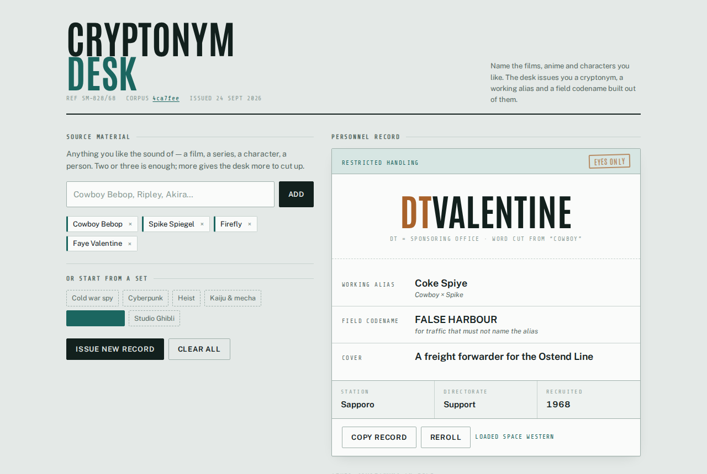
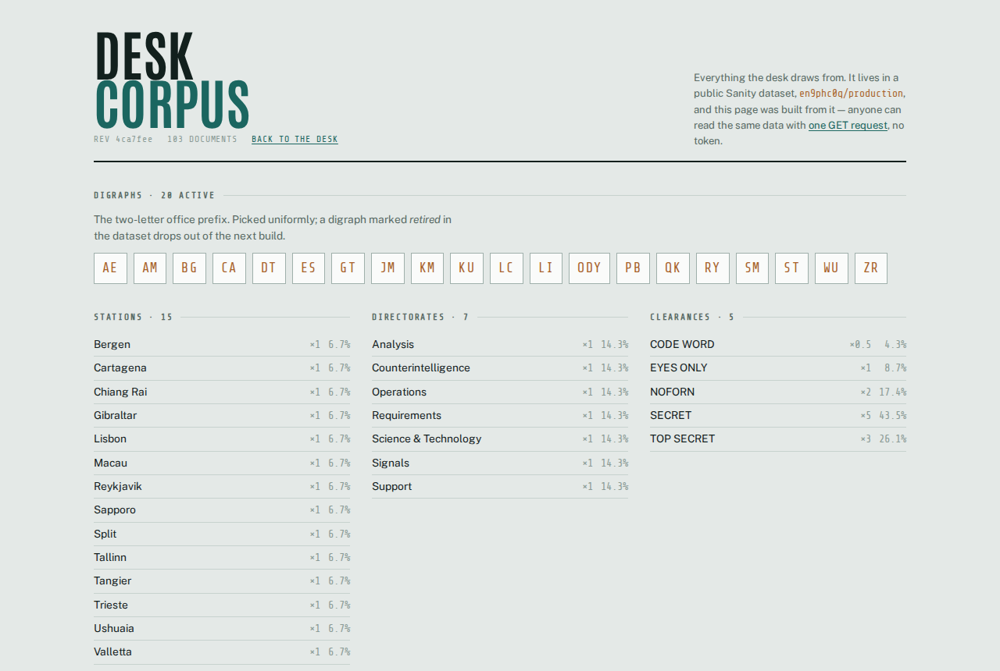
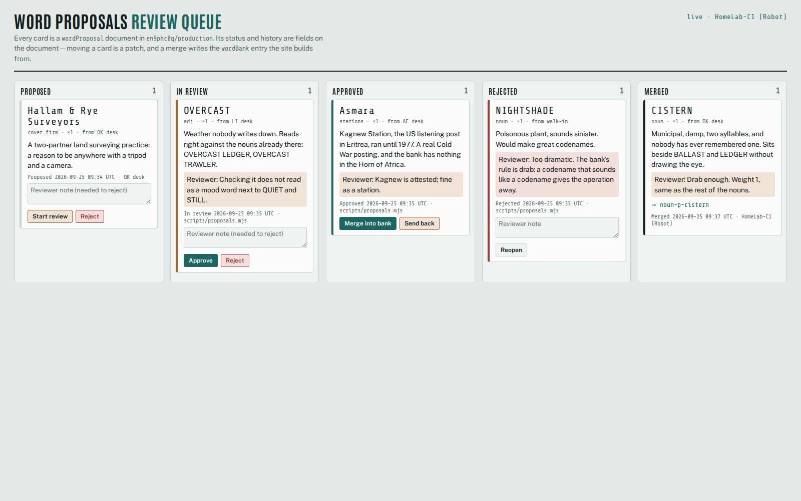
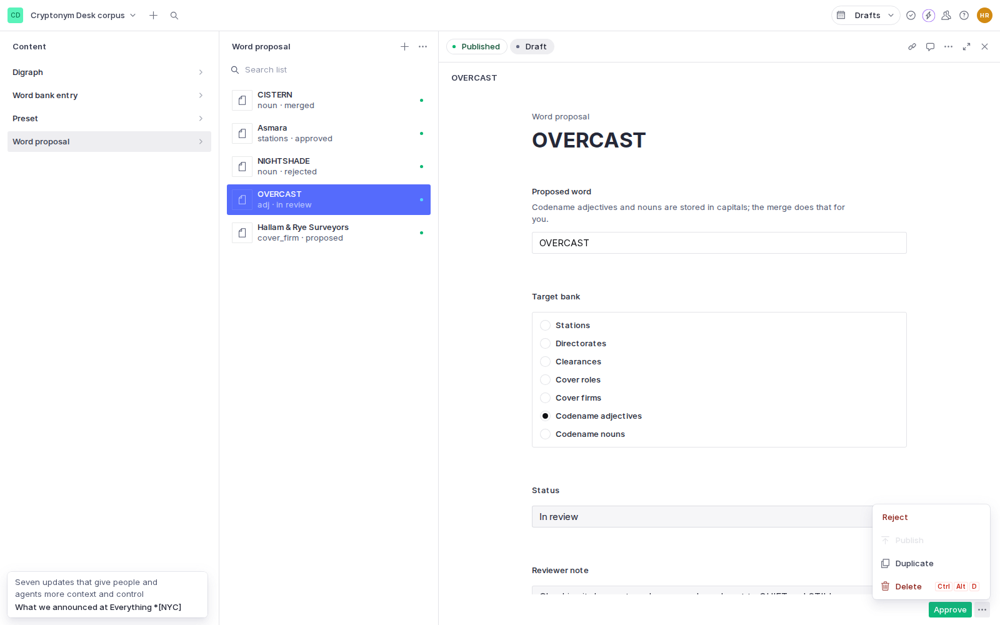
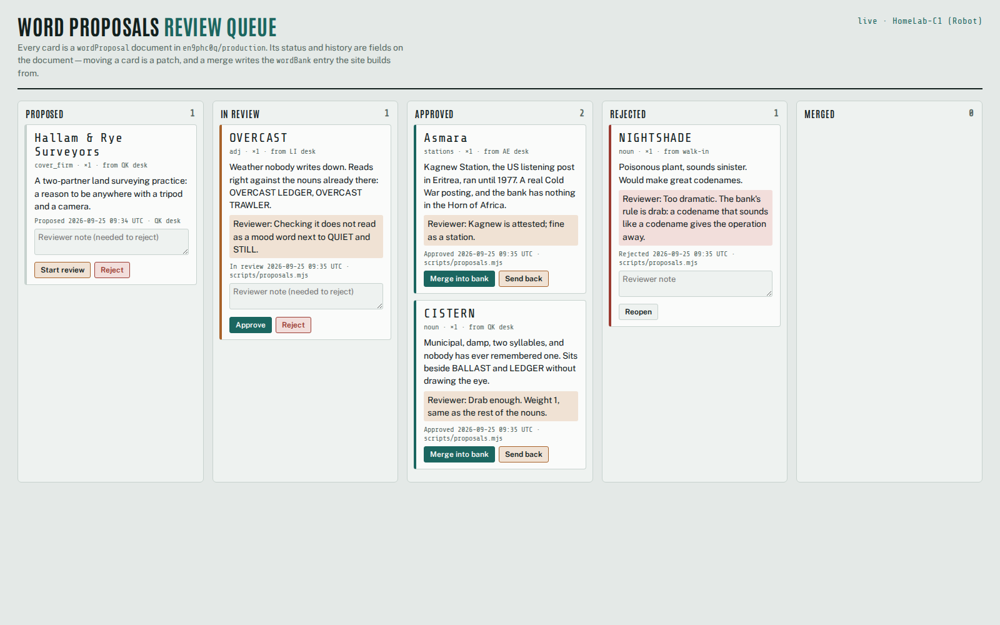
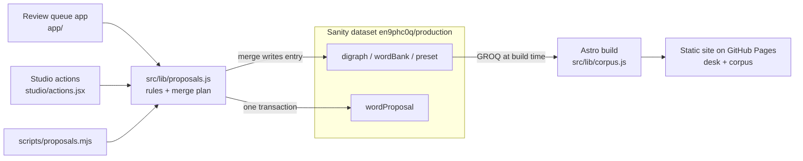

# Cryptonym Desk on Astro + Sanity

Name the films, anime and characters you like, and the desk issues you a cryptonym, a working alias and a field codename cut from them, with every word bank kept as data in a public Sanity dataset.



[](LICENSE)


Live: **[the desk](https://casareanderson.github.io/cryptonym-desk-sanity/)** and **[the corpus](https://casareanderson.github.io/cryptonym-desk-sanity/corpus/)**.

This is a rebuild of [Cryptonym Desk](https://github.com/casareanderson/cryptonym-desk), which is a single HTML file with its word banks hard-coded in a `<script>`. Here the digraphs, word banks and presets live in Sanity, the page is an Astro site built from them, and new words go through a review workflow before they reach a bank.

## Contents

- [What it does](#what-it-does)
- [Screenshots](#screenshots)
- [Quick start](#quick-start)
- [Usage](#usage)
- [Configuration](#configuration)
- [How it works](#how-it-works)
- [Status, limits and real results](#status-limits-and-real-results)
- [Licence and credits](#licence-and-credits)

## What it does

- Generates the same record as the original desk (cryptonym, working alias, field codename, cover, station, directorate, clearance, file reference) from your source material.
- Reads the whole corpus from Sanity **at build time only** and bakes it into the page. A visitor's browser never talks to Sanity, so what you type never leaves the page.
- Does a **weighted pick** from each word bank. Clearance stamps are weighted so `SECRET` is common and `CODE WORD` is rare; changing that is a dataset edit, not a code change.
- Prints a **corpus revision** on every record (a hash of every document's `_rev`), because a record can only be rebuilt against the corpus it was drawn from.
- **Refuses to build** from a bad corpus: an empty bank, an unknown bank, a zero weight, no active digraphs or no presets fails the build instead of shipping a page that throws on click.
- Runs a **word proposal workflow** in the same dataset, with three ways to move a proposal: an App SDK review queue, Studio document actions and a command-line script.
- Publishes a **corpus page** listing every digraph, word, weight and preset, plus the exact query the page was built with.

## Screenshots

| | |
|---|---|
|  |  |
| The corpus page, built from the dataset. | The review queue (App SDK), after `CISTERN` was merged. |
|  |  |
| Studio document actions on a proposal in review. | The same queue before `CISTERN` was merged. |

More captures in [`docs/`](docs/): [`studio-proposal-in-review.png`](docs/studio-proposal-in-review.png) and [`corpus-merged-word.png`](docs/corpus-merged-word.png) (the corpus after the merge, with `CISTERN` in the noun bank and 104 documents).

## Quick start

You need Node.js 20 and npm. No token is needed to build: the dataset is public-read.

```bash
git clone https://github.com/casareanderson/cryptonym-desk-sanity
cd cryptonym-desk-sanity
npm ci
npm test        # generator, corpus-validation and proposal-workflow tests (node:test)
npm run dev     # fetches the corpus from Sanity and serves the site locally
```

Success looks like `# pass 19` / `# fail 0` from the tests, and the desk at the local address Astro prints, under `/cryptonym-desk-sanity/`. `npm run build` writes the static site to `dist/` (2 pages).

## Usage

**Read the corpus** with one GET request and no token:

```
https://en9phc0q.api.sanity.io/v2024-01-01/data/query/production?query=*[_type in ["digraph","wordBank","preset"]]
```

**Move a word proposal** from a terminal. `list` is read-only; `move` and `merge` need `SANITY_AUTH_TOKEN`.

```bash
node scripts/proposals.mjs list
node scripts/proposals.mjs move <id> <in_review|approved|rejected|proposed> [note]
node scripts/proposals.mjs merge <id> [note]
```

`list` against the live dataset on 2026-10-08:

```
approved  stations     Asmara         wordProposal-asmara
merged    noun         CISTERN        wordProposal-cistern -> noun-p-cistern
proposed  cover_firm   Hallam & Rye Surveyors wordProposal-hallam-rye
rejected  noun         NIGHTSHADE     wordProposal-nightshade
in_review adj          OVERCAST       wordProposal-overcast
```

**Run the review queue app** locally, or deploy it to the organisation dashboard:

```bash
cd app && npm install && npx sanity dev
npx sanity deploy    # needs a user login with the org-level sanity.sdk.applications.deploy grant
```

A project robot token gets a 403 on deploy.

**Run the Studio** locally. The deployed Studio is at <https://cryptonym-desk.sanity.studio>; editing needs project membership, so the corpus page is the public view.

```bash
cd studio && npm install && npx sanity dev
```

## Configuration

The Sanity project is fixed in code (`src/lib/corpus.js`, `studio/sanity.config.js`, `app/src/App.jsx`, `scripts/*.mjs`): project `en9phc0q`, dataset `production`. Change it there to point at your own fork of the dataset.

| Name | Default | What it does |
|---|---|---|
| `SANITY_AUTH_TOKEN` | unset | Editor token for writes from `scripts/proposals.mjs` (`move`, `merge`) and `scripts/seed-proposals.mjs`. Not used by the site build. |
| `PROPOSAL_REVIEWER` | `scripts/proposals.mjs` | Name written to the `by` field of each history entry the script adds. |
| `SANITY_APP_DEV_TOKEN` | unset | Review queue app, dev server only: a token for a local run outside the dashboard. Never set for `sanity build` or deploy. |
| `base` in `astro.config.mjs` | `/cryptonym-desk-sanity` | Path the site is served under on GitHub Pages. |

Deployment is `.github/workflows/deploy.yml`: `npm ci`, `npm test`, `npm run build`, then GitHub Pages. It runs on push to `main`, by hand, and nightly at 05:17 UTC, so a dataset edit reaches the site on the next build. There is no webhook; that would need a GitHub token stored in Sanity, and a nightly rebuild is enough for a word list.

## How it works


```mermaid
flowchart LR
    subgraph Sanity["Sanity dataset en9phc0q/production"]
        D[digraph / wordBank / preset]
        P[wordProposal]
    end
    D -- "GROQ at build time" --> B[Astro build<br/>src/lib/corpus.js]
    B --> S[Static site on GitHub Pages<br/>desk + corpus]
    Q[Review queue app<br/>app/] --> R[src/lib/proposals.js<br/>rules + merge plan]
    ST[Studio actions<br/>studio/actions.jsx] --> R
    CLI[scripts/proposals.mjs] --> R
    R -- "one transaction" --> P
    R -- "merge writes entry" --> D
```

**The corpus.** 20 `digraph` documents, `wordBank` entries across 7 banks (`stations`, `directorates`, `clearances`, `cover_role`, `cover_firm`, `adj`, `noun`), each with a `weight`, and 6 `preset` documents. Retiring a digraph is a boolean on the document; it drops out of the next build. The schema is in [`studio/schemaTypes/index.js`](studio/schemaTypes/index.js), and the Studio enforces the same rules as the build.

**Word proposals.** New words arrive as `wordProposal` documents. The review state lives on each one: a `status` (`proposed → in_review → approved | rejected → merged`), a `reviewerNote`, and an append-only `history` of `{status, at, by, note}`. There is no second database: the dataset alone answers "who approved CISTERN, and when".

- [`src/lib/proposals.js`](src/lib/proposals.js) has no dependencies and holds the rules: the transition table (you can't skip review, and `merged` is final), the checks (a known bank, a weight above 0, a rationale; a rejection needs a note) and the merge plan. The Studio, the app and the script all call it.
- A merge writes a `wordBank` entry with a predictable id (`noun-p-cistern`), capitalises codename words, and patches the proposal to `merged` with a reference to the entry, all in one transaction. The patch is tied to the revision it was read at, so if two reviewers merge at once, one fails. If the word is already in the bank, no second entry is made.
- In the Studio, status, note and history are read-only fields, so they only change through an action.
- Proposals are left out of the corpus revision on purpose: moving a card doesn't change a record's `CORPUS` stamp, but merging one does.

```
cryptonym-desk-sanity/
├── src/
│   ├── lib/corpus.js        build-time fetch, validation, corpus revision
│   ├── lib/desk.js          the generator (splitter, mashup, weighted pick)
│   ├── lib/proposals.js     proposal rules and merge plan, no dependencies
│   └── pages/               index.astro (the desk), corpus.astro
├── public/desk.css
├── studio/                  Sanity Studio: schema, document actions
├── app/                     review queue, Sanity App SDK (@sanity/sdk-react)
├── scripts/                 proposals.mjs, seed-proposals.mjs
├── test/                    desk.test.js, proposals.test.js
├── docs/                    screenshots
└── .github/workflows/deploy.yml
```

## Status, limits and real results

Measured on 2026-10-08 from a fresh clone:

- `npm test`: 19 tests, 19 pass.
- `npm run build`: 2 pages built.
- Live dataset: 20 digraphs, 78 word-bank entries (77 imported, plus `CISTERN` merged through the workflow), 6 presets, so 104 corpus documents; and 5 word proposals.

The demo proposals were run against the live dataset: `CISTERN` went through every step and was merged from the app, `Asmara` is approved and waiting to be merged, `OVERCAST` is in review, `NIGHTSHADE` was rejected ("a codename that sounds like a codename gives the operation away"), and `Hallam & Rye Surveyors` is newly proposed.

**Two bugs the port found in the original desk:**

1. `MERIDIAN` was in the noun bank twice, so it was drawn twice as often as any other noun. Moving the list into documents made the duplicate obvious; it was dropped on import.
2. The syllable splitter did not do what its README said. The docs showed `Spiegel → Spie·gel` and `Kusanagi → Ku·sa·na·gi`; the regex kept one consonant after each vowel group (`Spieg·el`, `Kus·an·ag·i`), so the README's own example, `Spienagi`, could never come out. A test for the documented behaviour caught it. This port fixes the code to match the documentation, so the same inputs give different aliases from the original version.

**Limits:**

- A dataset edit reaches the site only on the next build (push, manual run or the nightly schedule).
- A record is only rebuildable against the corpus revision printed on it.
- Writes to the dataset need project membership; the public can read but not propose words directly.

## Licence and credits

MIT, see [LICENSE](LICENSE). The original single-file desk is by the same author under the same licence.

Built with [Astro](https://astro.build) and [Sanity](https://www.sanity.io) (Studio, `@sanity/client`, App SDK).
